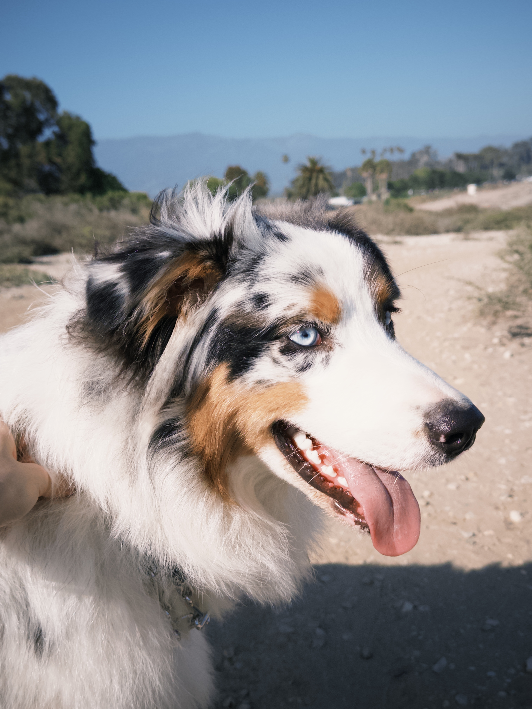
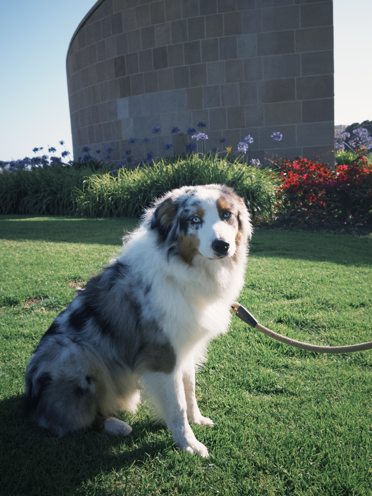
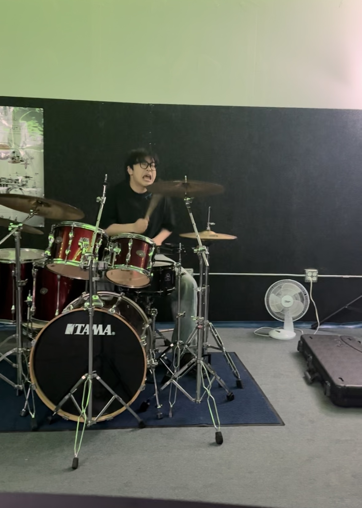
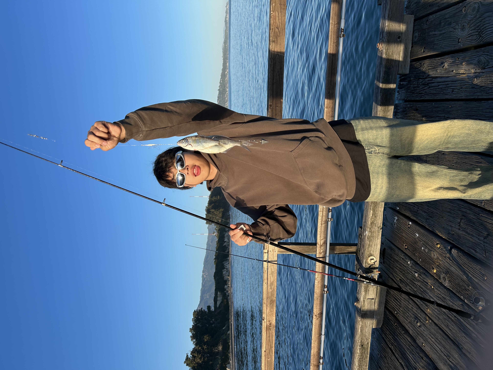

## Who I am

I'm Zhelin Qi, an Environmental Studies student at UC Santa Barbara. I'm interested in the intersection of ecology, data science, and conservation. When I'm not crunching data in R, I'm taking care of my leachianus geckos, fishing, playing drums, or spending time with my dog Auggie.

---

## Education

**University of California, Santa Barbara**
B.S. Environmental Studies *(in progress)*

I've developed skills in environmental data analysis, statistics, and science communication. I use R, Quarto, and GitHub as core tools in my workflow.

---

## Research Experience

**Yongjiang Laboratory — Inorganic Silica Synthesis**
I interned in an inorganic chemistry research lab focused on the synthesis and preparation of oxidized silica materials. This experience gave me hands-on lab skills and an appreciation for materials science at the intersection of chemistry and environmental applications.

**UCSB Oceanography Laboratory**
I worked as an intern in UCSB's Oceanography Lab, where I was exposed to marine science research methods, data collection, and the study of ocean ecosystems. This experience deepened my interest in environmental data and coastal ecology.

---

## My Dog — Auggie

::: {layout-ncol=2}

:::

Meet **Auggie**, my 10-month-old Australian Shepherd. He is endlessly energetic, loves fetch, and joins me on outdoor adventures around Santa Barbara. He is also the subject of my personal data collection project — I've been tracking his daily play sessions to understand what makes him happiest!

---

## Hobbies

::: {layout-ncol=2}

:::

I play **drums** and enjoy the focus and rhythm that music brings. I also love **fishing** — there's nothing better than being out on the water early in the morning. Both hobbies give me a break from screens and connect me to something more physical and present.
