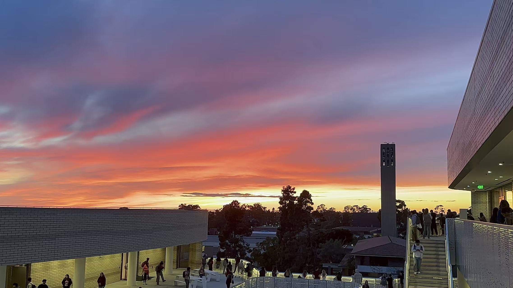

::: {.hero-section}

# Zhelin Qi

**Environmental Studies @ UC Santa Barbara**

Reptile keeper · Data scientist in training · Founder of [Dimension of Leachies](leachies.qmd)

:::

{width=100% style="border-radius: 8px; margin-bottom: 1.5rem;"}

---

## Hello! 👋

I'm Zhelin, an Environmental Studies student at UC Santa Barbara with a passion for data science, ecology, and exotic reptiles. I use R and Quarto to analyze environmental data, and outside of class I run a reptile hobby studio focused on leachianus geckos and other lizards.

I have research experience in inorganic silica synthesis at Yongjiang Laboratory and marine science at UCSB's Oceanography Lab.

---

## Quick links

- 🦎 [Dimension of Leachies — my reptile studio](leachies.qmd)
- 📊 [Projects & data analysis](projects.qmd)
- 👤 [About me](about.qmd)
- 📄 [Resume](resume.qmd)
