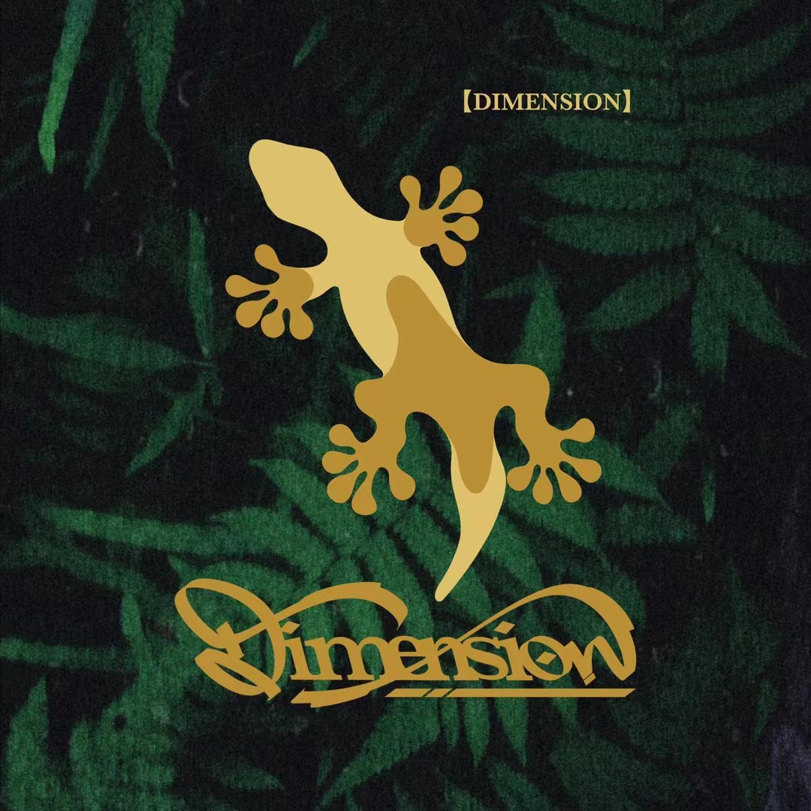
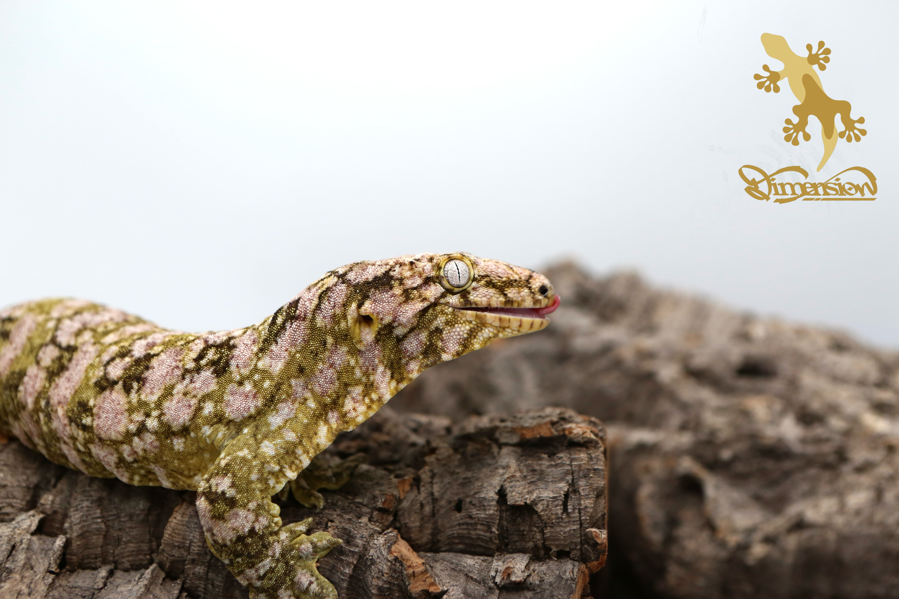
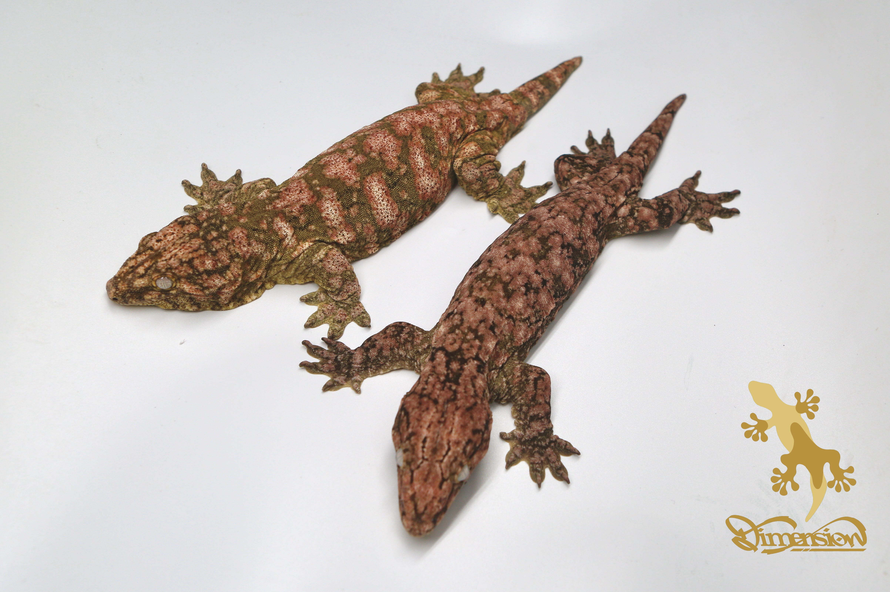
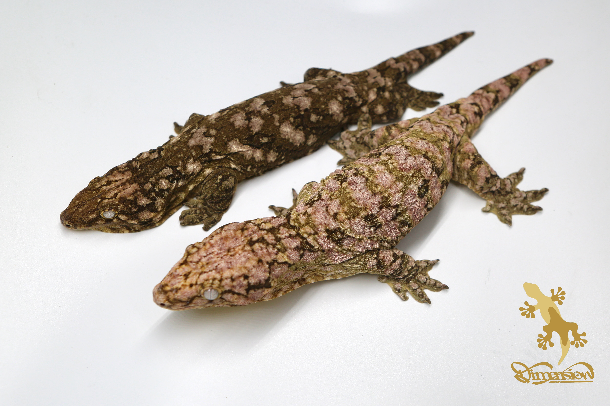
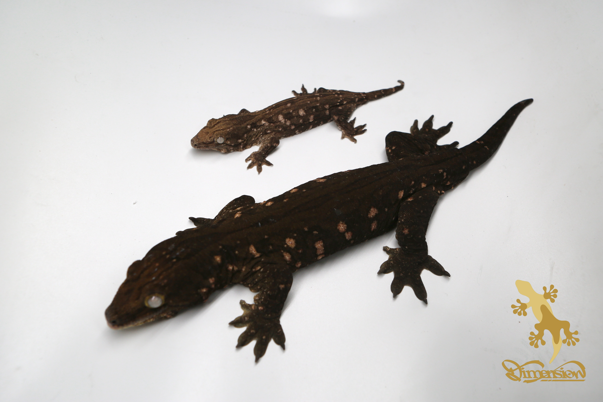
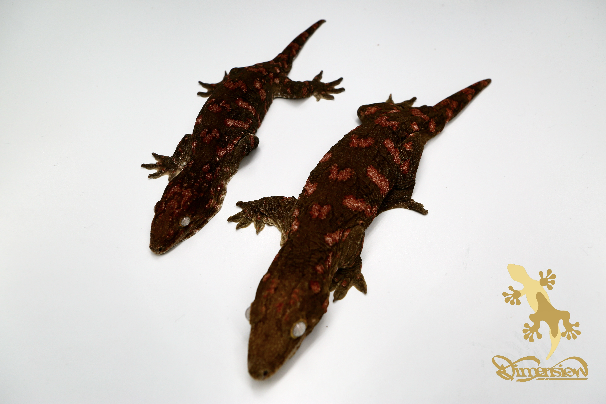
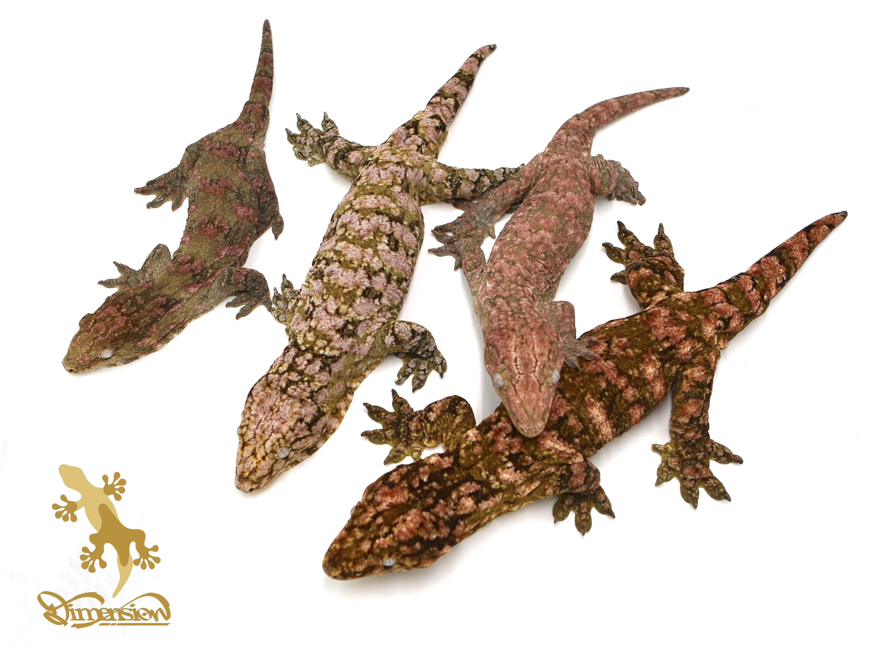
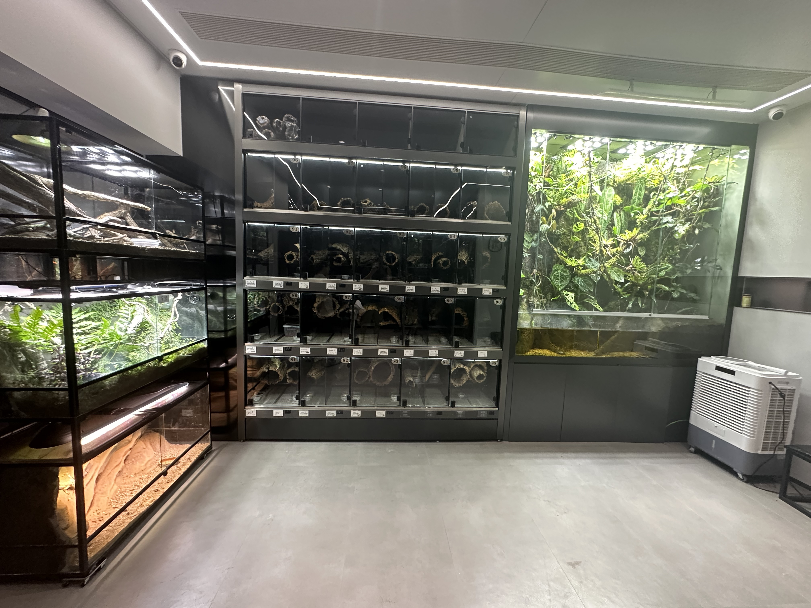
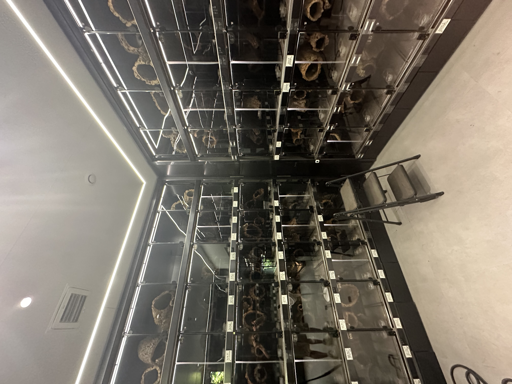

## About the Studio

::: {layout-ncol=2}
{width=100%}

**Dimension of Leachies (巨人维度)** was founded in 2020 with a focus on the breeding and selective development of *Rhacodactylus leachianus* — the **leachianus gecko**, the largest gecko species in the world. The studio is dedicated to producing higher-quality breeding lines and advancing the genetics of this remarkable species.

Over the years, the studio has developed multiple distinct breeding lines, each selected for specific color patterns, body structure, and temperament.
:::

---

## The Animals — Rhacodactylus leachianus

Leachianus geckos are native to New Caledonia in the South Pacific. They are nocturnal, arboreal animals known for their impressive size (adults reach 25–35 cm), unique vocalizations (growls, barks, hisses), and remarkable color variation.

{width=70% fig-align="center"}

*A leachianus gecko showing its characteristic posture and scale texture.*

---

## Breeding Lines

### SHCGL — Super High Color Giant Line

The SHCGL line is selected for exceptionally vibrant coloration combined with large body size. Animals in this line display rich pink, orange, and green tones with high contrast patterning.

{width=80% fig-align="center"}

*Two SHCGL individuals showing the characteristic high-contrast pink and green coloration.*

---

### Swirl Line

The Swirl line is selected for a distinctive swirling pattern across the dorsum. These animals show a blend of earth tones with flowing, irregular markings that give each individual a unique appearance.

{width=80% fig-align="center"}

*Two Swirl line individuals showing the characteristic flowing pattern.*

---

### Goro Line — Melanistic Straight Line

The Goro line focuses on high melanin expression, producing animals with deep brown to near-black base coloration with subtle lighter spotting. This line is one of the most visually striking in the collection.

{width=80% fig-align="center"}

*Two Goro line individuals displaying the characteristic dark, melanistic coloration.*

---

### Darth Maul Line

Named for its bold red-on-black patterning, the Darth Maul line is selected for deep red blotches against a dark background. These animals are among the most sought-after in the collection.

{width=80% fig-align="center"}

*Two Darth Maul line individuals showing the signature red-on-dark coloration.*

---

## The Collection

The studio currently maintains dozens of individuals across multiple breeding lines, spanning juveniles to proven adult pairs.

{width=80% fig-align="center"}

*A group of leachianus geckos from various lines in the collection.*

---

## The Facility

The studio is purpose-built for leachianus keeping, with individually labeled enclosures for each animal, climate control, and naturalistic cork tube hides that mimic the hollow trees these geckos use in the wild.

{width=80% fig-align="center"}

{width=80% fig-align="center"}


*The studio facility, housing over 100 individual enclosures with climate-controlled conditions.*

---

## Interactive: Native Range Map

The map below shows the native range of *Rhacodactylus leachianus* in New Caledonia, the island group where all leachianus geckos originate.

```{r map, message=FALSE, warning=FALSE, echo=FALSE}
library(leaflet)

leaflet() |>
  addTiles() |>
  setView(lng = 165.6, lat = -21.3, zoom = 7) |>
  addCircleMarkers(
    lng = 165.6, lat = -21.3,
    radius = 20,
    color = "#a8d8a8",
    fillOpacity = 0.4,
    popup = "Native range of Rhacodactylus leachianus — New Caledonia"
  ) |>
  addCircleMarkers(
    lng = 167.9, lat = -22.1,
    radius = 10,
    color = "#a8d8a8",
    fillOpacity = 0.3,
    popup = "Isle of Pines — home to the giant leachie (R. l. leachianus)"
  )
```

---

## Contact

Interested in leachianus geckos or have questions about the studio?

- 📧 Email: zhelin5258@gmail.com
- 🐙 GitHub: [zhelin-qi](https://github.com/zhelin-qi)
