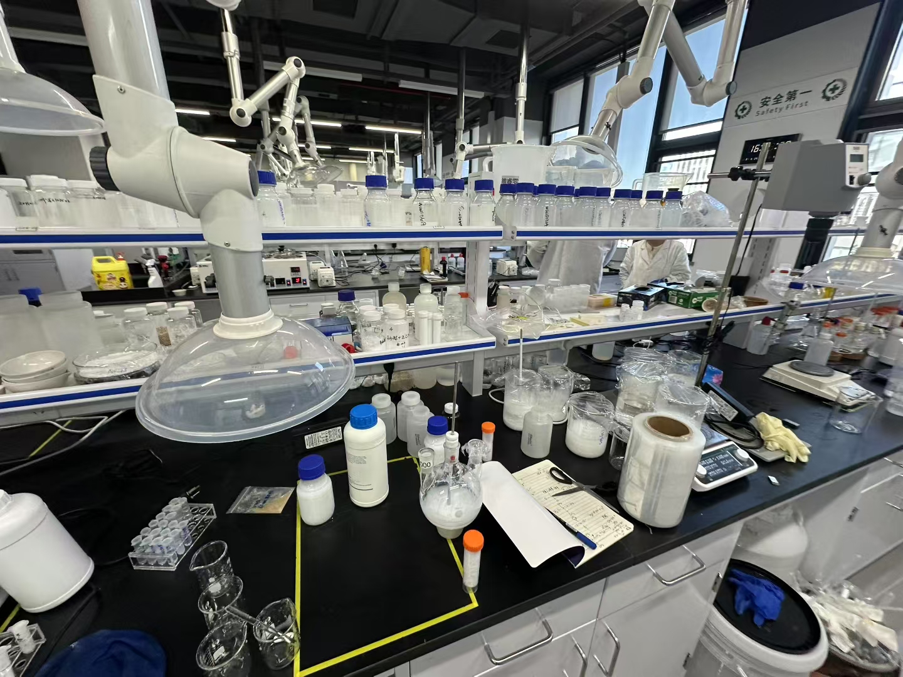
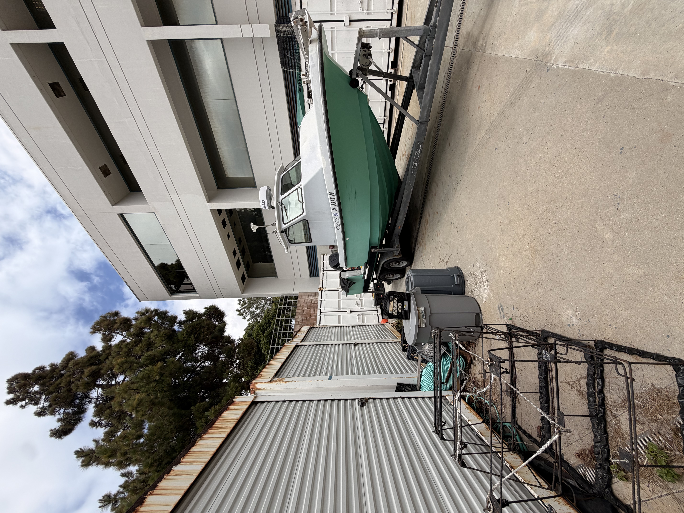
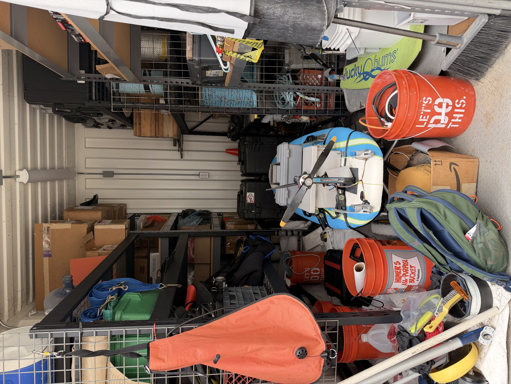

## Zhelin Qi

📧 zhelin5258@gmail.com · 🐙 [github.com/zhelin-qi](https://github.com/zhelin-qi)

---

## Education

**University of California, Santa Barbara** *(in progress)*
B.S. Environmental Studies

Relevant coursework: Environmental Data Science (ENVS 193DS), Environmental Field Methods (ENVS 153), Ecology, Marine Science, Statistics

---

## Research & Internship Experience

### Inorganic Silica Synthesis Intern
**Yongjiang Laboratory (甬江实验室) — Inorganic Silicon Oxide Material Controllable Preparation Research Center**

::: {layout-ncol=2}

:::

- Assisted in the synthesis and preparation of nano- and micro-scale inorganic oxidized silica materials
- Supported research focused on applications in semiconductor CMP, chip packaging, 5G materials, and pharmaceutical purification
- Performed laboratory procedures including sample preparation, characterization, and experimental documentation
- Developed hands-on skills in materials chemistry, lab safety, and precision measurement

---

### Marine Science Intern
**UCSB Oceanography Laboratory**

::: {layout-ncol=2}

:::

- Supported ongoing marine science research at UCSB's Oceanography Lab
- Assisted with data collection, sample processing, and field/lab methods in coastal marine environments
- Gained experience in ocean ecosystem research and environmental data workflows

---

## Projects

**Personal Quarto Website** · [zhelin-qi.github.io](https://zhelin-qi.github.io)
Built a personal website using Quarto, R, and GitHub Pages, showcasing data analysis projects and personal interests.

**Spring Seasonal Change at Campus Point** · ENVS 153
Led 8-week field observations tracking plant phenology, pollinator abundance, and bird species richness at UCSB's Campus Point lagoon. Analyzed and visualized trends in R.

**Giant Kelp Temperature Analysis** · ENVS 193DS
Analyzed the relationship between ocean temperature and kelp frond elongation rate using Pearson and Spearman correlation in R.

**Personal Data Collection & Visualization** · ENVS 193DS
Designed and executed a 6-week personal data collection project tracking dog play sessions, analyzed with ggplot2 in R.

---

## Skills

**Technical:** R, Quarto, GitHub, ggplot2, tidyverse, data visualization, statistical analysis

**Laboratory:** Inorganic materials synthesis, sample preparation, characterization, lab safety, precision measurement

**Field:** Ecological observation, species identification (plants, birds, insects), field data collection

**Languages:** English, Mandarin Chinese

---

## Other Experience

**Founder — Dimension of Leachies (巨人维度)**
*Personal reptile hobby studio, founded 2020*

- Founded and manage a reptile keeping studio specializing in leachianus geckos (*Rhacodactylus leachianus*)
- Developed and maintain multiple selective breeding lines (SHCGL, Swirl, Goro, Darth Maul)
- Responsible for all aspects of animal care, health monitoring, enclosure design, and line documentation
